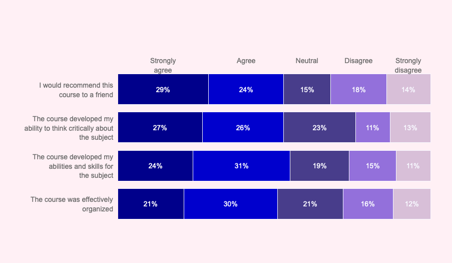

# 📊 Survey Analysis Visualization Tool

This project allows you to visualize **Likert-scale survey data** using an interactive, horizontal stacked bar chart built with **Plotly**. It's ideal for analyzing post-event surveys, feedback forms, or any opinion-based questionnaires.

The visualization dynamically breaks down responses like **Strongly Agree**, **Agree**, **Neutral**, etc., per question, ensuring results are easy to interpret and share.

## 📈 Output




---


---


## 📂 Project Structure

```plaintext
survey-analysis/
├── data/
│   └── survey_results.csv        
├── survey_visualizer.py        
├── requirements.txt         
└── README.md


🔍 Code Explanation
This project loads survey data from a CSV file and visualizes it using a stacked horizontal bar chart in Plotly. Each question is displayed with responses categorized by a 5-point Likert scale (e.g., Strongly Agree, Agree, etc.).
Below is a breakdown of how the code works:

1. 📦 Import Required Libraries
import pandas as pd
import numpy as np
import plotly.graph_objects as go
import math

pandas: for reading and manipulating the CSV data
numpy: general numerical operations
plotly.graph_objects: for building interactive charts
math: used to wrap long questions for readability

2. 📁 Load the Survey Data
df = pd.read_csv("data/survey_results.csv")

3. ✅ Validate Row Totalsvalues = df.iloc[:, 1:6].values.tolist()
for v in values:
    if not sum(v) == 100:
        raise ValueError("There is a row that does not add up to 100%.")

4. 🛠 Customize Plot Settings
# Title and size
title = "Post-Conference Survey Results - Feb 2022"
width = 900
height = 500

# Colors for each Likert response
background_color = "WhiteSmoke"
colors = ["#488f31", "#b2b264", "#fbdbb1", "#ea936d", "#de425b"]

# Font settings
title_font = dict(family="Helvetica", size=20, color="black")
questions_font = dict(family="Helvetica", size=14, color="black")
likert_scale_font = dict(family="Helvetica", size=14, color="black")
percent_font = dict(family="Helvetica", size=16, color="#434343")

5. 📋 Define Likert Scale Labels
labels = [
    "<b>Strongly<br>agree<b>",
    "<b>Agree<b>",
    "<b>Neutral<b>",
    "<b>Disagree<b>",
    "<b>Strongly<br>disagree<b>",
]


6. 🧹 Format Questions for Display
questions = []
qs = df.iloc[:, 0].tolist()
for q in qs:
    words = q.split()
    for w in range(1, int(math.ceil((len(words) / 5)))):
        words.insert(w * 5, "<br>")
    questions.append(" ".join(words))

7. 📊 Create the Plotly Figure
fig = go.Figure()

8. 📦 Add Bars to the Chartfor i in range(0, len(values[0])):
    for xd, yd in zip(values, questions):
        fig.add_trace(
            go.Bar(
                x=[xd[i]],
                y=[yd],
                orientation="h",
                marker=dict(color=colors[i]),
            )
        )

9. 🎨 Customize the Layout
fig.update_layout(
    title=title,
    title_font=title_font,
    width=width,
    height=height,
    barmode="stack",
    ...
)

10. 📝 Add Annotations (Text Labels)
annotations = []
...
fig.update_layout(annotations=annotations)


11. 🚀 Display the Chart
fig.show()

Results:


